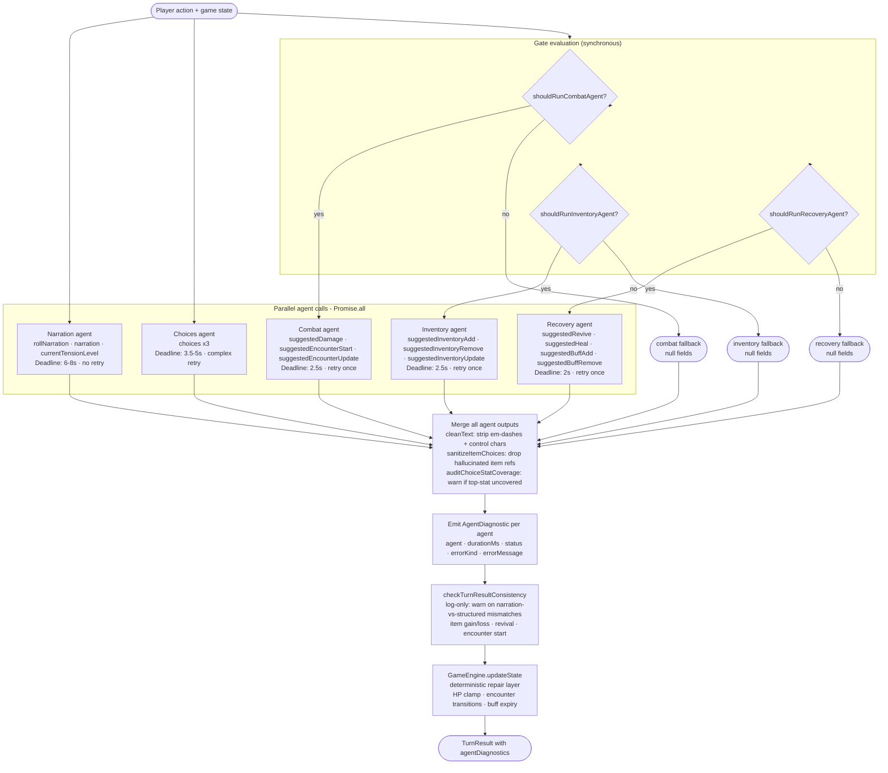

# Multi-Agent Turn Workflow

Every player action triggers a parallel multi-agent pipeline. Two agents always run (narration, choices); three more run conditionally based on the turn context. Each agent owns a strict set of output fields and must not instruct or set fields owned by another agent.

---

## Agent Field Ownership

| Agent | Owns | Never sets |
|---|---|---|
| **Narration** | `narration`, `rollNarration`, `currentTensionLevel` | choices, inventory, HP/buffs, encounter mutation |
| **Choices** | `choices` (exactly 3) | narration, inventory, HP/buffs, encounter mutation |
| **Combat** | `suggestedDamage`, `suggestedEncounterStart`, `suggestedEncounterUpdate` | narration, choices, inventory, HP healing, buffs |
| **Inventory** | `suggestedInventoryAdd`, `suggestedInventoryRemove`, `suggestedInventoryUpdate` | narration, choices, HP, buffs, encounter mutation |
| **Recovery** | `suggestedRevive`, `suggestedHeal`, `suggestedBuffAdd`, `suggestedBuffRemove` | narration, choices, inventory, encounter mutation |

---

## Gate Functions

The combat, inventory, and recovery agents only run when the turn context needs them.

**`shouldRunCombatAgent`** - runs when:
- `encounterState.status === 'active'` (active combat turn), OR
- `hasEncounterStartSignal` is true: `sceneMomentum.suggestedNextBeat` includes `suggestedEncounterStart`, OR `sceneMomentum.directive === 'climax_pressure'`, OR `gameMode === 'zug-ma-geddon'`

**`shouldRunInventoryAgent`** - runs when:
- Trade turn (action or recent scene mentions vendor/trade/give keywords), OR
- Loot turn (`encounterState.status === 'active'` or `encounterJustResolved`), OR
- `actionIntent === 'improve_item'` (item enchant action)

**`shouldRunRecoveryAgent`** - runs when:
- Any party member has `status === 'downed'`, OR
- Any party member has active buffs/curses, OR
- `sanctuaryRecovery` or `interventionRescue` is set, OR
- `actionIntent` is `bless_character`, `aid_character`, or `party_boost`

---

## Deadlines and Retry Behavior

All agents run inside `withDeadline`, which aborts the request and returns a safe fallback if the deadline is exceeded.

| Agent | Deadline (standard) | Deadline (relaxed*) | Retry on parse error | Notes |
|---|---|---|---|---|
| Narration | 6000 ms | 8000 ms | No | Falls back to `buildNarrationFallback(input)` |
| Choices | 3500 ms first attempt | 5000 ms | Full retry (narration tier) | Complex retry: stat-coverage check, corrective retry, then plain retry |
| Combat | 2500 ms | - | Yes (once) | Fallback: all-null combat fields |
| Inventory | 2500 ms | - | Yes (once) | Fallback: all-null inventory fields |
| Recovery | 3000 ms | - | Yes (once) | Fallback: all-null recovery fields |

*Relaxed deadlines apply on `isFirstTurn`, `interventionRescue`, or `sanctuaryRecovery` turns.

**Choices retry logic** is more elaborate because a bad choice set is a worse player experience than a short delay:
1. First attempt uses `preview` model tier (faster, less contention).
2. If choices are returned but are **stale** (all labels match `previousChoiceLabels` verbatim - the model echoed back options seen within the last 5 turns): one corrective `choices-stale-retry` on the `narration` tier with an explicit instruction to generate fresh choices.
3. If choices are returned but none use the next character's top stat: one corrective `choices-coverage-retry` on the `narration` tier. Both failures can be combined into a single retry instruction.
4. If the corrective retry fails: `ensureTopStatCoverage` injects a deterministic fallback choice replacing the weakest-stat option; stale content is used as the base.
5. If the first attempt failed entirely: one plain `choices-retry` on the `narration` tier.
6. If all attempts fail: generic 3-choice fallback (one per stat); `choicesFailed: true`.

**Choices agent context** - the choices agent receives the full `storySummary` (including CURRENT ARC, NEXT PROMISED BEAT, LOCATION STALL), `sceneMomentum`, `previousChoiceFlavors`, `selectedChoiceFlavor`, and the last 3 `recentHistory` entries. It also conditionally includes `SECTION_LOCATION_STALL` and `SECTION_FROZEN_CONFRONTATION` in its system prompt (same gates as the narration agent) so it responds to story-arc signals, not just mechanical context.

Story-arc signals (`storySummary`, `sceneMomentum`, `SECTION_LOCATION_STALL`, `SECTION_FROZEN_CONFRONTATION`) are suppressed in two situations where the fight/victory is its own story beat:
- **Active combat** (`encounterState.status === 'active'`): replaced by `SECTION_ACTIVE_COMBAT_CHOICES` requiring direct enemy engagement
- **Encounter resolution** (`encounterJustResolved: true`): replaced by `SECTION_POST_ENCOUNTER_CHOICES` with `encounterObjective` and `encounterLootHint` to advance into what the encounter unlocked

**Error classification** - `classifyAgentError` maps thrown errors to `AgentErrorKind`:
- `refusal` - model refused the request
- `content_filter` - output blocked by content policy
- `length` - output truncated by `max_completion_tokens`
- `no_parsed` - structured output missing from response
- `schema` - Zod schema validation failed on parsed output
- `network` - connection or provider error
- `timeout` - `withDeadline` fired before the agent responded

---

## Workflow Diagram



---

## Fallback Behavior

Every agent has a typed fallback returned on timeout or unrecoverable error. The narration fallback (`buildNarrationFallback`) generates deterministic prose from the action result so the player always gets a response. Choices fallback generates one option per stat. Combat, inventory, and recovery fallbacks are all-null - the game engine handles the missing signals through its own deterministic rules.

`narrationFailed: true` is set in the result when the narration agent fell back. `choicesFailed: true` is set when the choices retry chain exhausted all attempts.

---

## Consistency Guard

`checkTurnResultConsistency` runs after the merge and before `GameEngine.updateState`. It is log-only (uses `devLog.warn`, never blocks or repairs). It checks four heuristics:

- **Item gain**: narration contains gain verbs (finds, receives, loots, etc.) but `suggestedInventoryAdd` is null.
- **Item loss**: narration contains loss verbs (stolen, loses, sacrifices, etc.) but `suggestedInventoryRemove` is null.
- **Revival**: narration contains revival phrases and a party member is downed, but `suggestedRevive` is null.
- **Encounter start**: narration contains combat-start phrases, no active encounter, but `suggestedEncounterStart` is null.

The intent is observability for prompt-tuning: warnings surface in dev logs and can be correlated with agent diagnostics to identify systematic gaps.

---

## Agent Diagnostics

Every running agent pushes an `AgentDiagnostic` entry into the result:

```typescript
interface AgentDiagnostic {
  agent: string;         // 'narration' | 'choices' | 'choices-retry' | 'choices-coverage-retry' | 'combat' | 'inventory' | 'recovery'
  durationMs: number;
  status: 'ok' | 'retry' | 'timeout' | 'fallback';
  errorKind?: AgentErrorKind;   // set when status is timeout or fallback
  errorMessage?: string;
}
```

`agentDiagnostics` is included in `TurnResult` and persisted with the turn record, making per-agent latency and failure rates queryable from stored session data.

---

## Agent Input Context

Each agent receives a focused subset of `NarrationInput` in its user message. The narration agent receives the full input; all others receive a curated projection. Key fields per agent:

| Agent | Notable input fields |
|---|---|
| **Narration** | Full `NarrationInput` as JSON (all fields) |
| **Choices** | `storySummary` (full), `sceneMomentum`, `recentHistory[-3]`, `previousChoiceLabels` (last 5 turns deduplicated), `previousChoiceFlavors`, `selectedChoiceFlavor`, next character's `inventory`, party with buffs; in active combat: enemy `traits`, `revealedWeaknesses`, `maxHp`, area effects |
| **Combat (active)** | `encounterState` (full), `actionResult` (success/impact/statUsed), `party` HP, `encounterJustResolved`, `encounterLootHint` |
| **Combat (encounter-start)** | `dmPrepEncounters`, `sceneMomentum`, `storySummary` (full), `recentHistory[-3]`, `resolvedEncounterEnemyNames` |
| **Inventory** | Full `inventory`, `actionResult` (success/impact/difficulty), `actingCharacterName`, `encounterLootHint`, `party` class+stats, `recentHistory[-2]` |
| **Recovery** | `party` HP+buffs, `actingCharacterName`, `actionResult` (success/impact), `actionIntent`, `sanctuaryRecovery`, `interventionRescue` |

The parallel constraint means no agent can see the current turn's narration (generated concurrently). Agents decide from prior context only.

---

## Key Files

| File | Role |
|---|---|
| `backend/src/services/dmTurnOrchestrator.ts` | Orchestrator: gate functions, `withDeadline`, `callStructuredAgent`, parallel fan-out, merge |
| `backend/src/providers/ai/narration/agentPrompts.ts` | System prompt builders for each agent |
| `backend/src/providers/ai/narration/narrationPromptSections.ts` | Reusable prompt section constants (imported by prompt builders) |
| `backend/src/providers/ai/narration/agentSchemas.ts` | Zod output schemas per agent |
| `backend/src/services/turnResultConsistencyService.ts` | Post-merge consistency guard (log-only) |
| `backend/src/services/aiDmService.ts` | Calls the orchestrator, wires result into `TurnResult` |
| `packages/shared/src/types.ts` | `AgentErrorKind`, `AgentDiagnostic`, `TurnResult.agentDiagnostics` |
