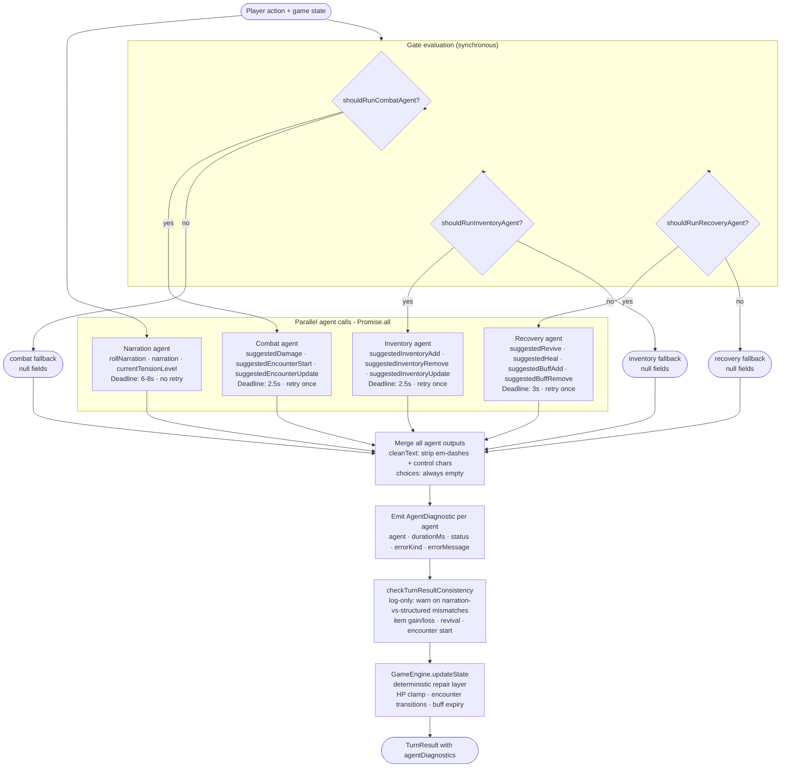
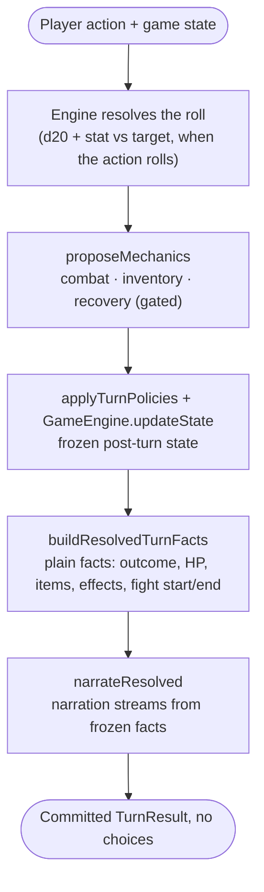

# Multi-Agent Turn Workflow

Every player action triggers a multi-agent pipeline (resolved-first by default, see below; the parallel layout described first is the opt-out and still serves opening, rescue, and chapter-start turns). The narration agent always runs; three mechanics agents (combat, inventory, recovery) run conditionally based on the turn context. Each agent owns a strict set of output fields and must not instruct or set fields owned by another agent.

Turns do not generate suggested actions. The choices agent runs only when a player asks for ideas (**Give me ideas**, or the per-adventure setting **Ideas every turn**, which asks once after each turn settles): see [Ideas on request](#ideas-on-request). Turns stored before this change may still carry their own choices; those are legacy data and are shown as they were.

---

## Agent Field Ownership

| Agent | Owns | Never sets |
|---|---|---|
| **Narration** | `narration`, `rollNarration`, `currentTensionLevel` | choices, inventory, HP/buffs, encounter mutation |
| **Choices** (ideas on request only) | `choices` (exactly 3) | narration, inventory, HP/buffs, encounter mutation |
| **Combat** | `suggestedDamage`, `suggestedEncounterStart`, `suggestedEncounterUpdate` | narration, choices, inventory, HP healing, buffs |
| **Inventory** | `suggestedInventoryAdd`, `suggestedInventoryRemove`, `suggestedInventoryUpdate` | narration, choices, HP, buffs, encounter mutation |
| **Recovery** | `suggestedRevive`, `suggestedHeal`, `suggestedBuffAdd`, `suggestedBuffRemove` | narration, choices, inventory, encounter mutation |

---

## Gate Functions

The combat, inventory, and recovery agents only run when the turn context needs them.

**`shouldRunCombatAgent`** - runs when:
- `encounterState.status === 'active'` (active combat turn), OR
- `hasEncounterStartSignal` is true: `sceneMomentum.suggestedNextBeat` includes `suggestedEncounterStart`, OR `sceneMomentum.directive === 'climax_pressure'`, OR `gameMode === 'zug-ma-geddon'`

**`shouldRunInventoryAgent`** - runs when:
- Trade turn (action or recent scene mentions vendor/trade/give keywords), OR
- Loot turn (`encounterState.status === 'active'` or `encounterJustResolved`), OR
- `actionIntent === 'improve_item'` (item enchant action)

**`shouldRunRecoveryAgent`** - runs when:
- Any party member has `status === 'downed'`, OR
- Any party member has active buffs/curses, OR
- `sanctuaryRecovery` or `interventionRescue` is set, OR
- `actionIntent` is `bless_character`, `aid_character`, or `party_boost`

---

## Deadlines and Retry Behavior

All agents run inside `withDeadline`, which aborts the request and returns a safe fallback if the deadline is exceeded.

| Agent | Deadline (standard) | Deadline (relaxed*) | Retry on parse error | Notes |
|---|---|---|---|---|
| Narration | 6000 ms | 8000 ms | No | Falls back to `buildNarrationFallback(input)` |
| Combat | 2500 ms | - | Yes (once) | Fallback: all-null combat fields |
| Inventory | 2500 ms | - | Yes (once) | Fallback: all-null inventory fields |
| Recovery | 3000 ms | - | Yes (once) | Fallback: all-null recovery fields |

*Relaxed deadlines apply on `isFirstTurn`, `interventionRescue`, or `sanctuaryRecovery` turns.

**Error classification** - `classifyAgentError` maps thrown errors to `AgentErrorKind`:
- `refusal` - model refused the request
- `content_filter` - output blocked by content policy
- `length` - output truncated by `max_completion_tokens`
- `no_parsed` - structured output missing from response
- `schema` - Zod schema validation failed on parsed output
- `network` - connection or provider error
- `timeout` - `withDeadline` fired before the agent responded

---

## Ideas on request

`POST /session/:id/ideas` (`services/ideasService.ts`) generates suggested actions for the latest turn, its revision, and the hero who acts next. The result is stored on that turn and shared by every viewer; asking never advances the story or bumps the revision, and an action accepted meanwhile always wins (the ideas are dropped as stale). Generation is limited to 6 per session per minute. The per-adventure setting **Ideas every turn** makes each open view ask once after a turn settles; the server still generates one set per turn and revision.

Ideas go through `generateIdeas` -> `runChoicesWithRetry` in `dmTurnOrchestrator.ts`, then `toPlayerChoices` (`sanitizeItemChoices` drops item choices for gear the hero does not carry, `auditChoiceStatCoverage` warns when the hero's top stat is uncovered). Riddle answer choices are then synced to the recorded riddle (`syncRiddleChoices`), never the agent's own guess.

| Attempt | Deadline (standard) | Deadline (relaxed*) |
|---|---|---|
| First (`preview` tier) | 3500 ms | 5000 ms |
| Corrective or plain retry (`narration` tier) | 3000 ms | 3000 ms |

**Choices retry logic** is more elaborate because a bad choice set is a worse player experience than a short delay:
1. First attempt uses `preview` model tier (faster, less contention).
2. If choices are returned but are **stale** (all labels match `previousChoiceLabels` verbatim - the model echoed back options seen within the last 5 turns): one corrective `choices-stale-retry` on the `narration` tier with an explicit instruction to generate fresh choices.
3. If choices are returned but none use the next character's top stat: one corrective `choices-coverage-retry` on the `narration` tier. Both failures can be combined into a single retry instruction.
4. If the corrective retry fails: `ensureTopStatCoverage` injects a deterministic fallback choice replacing the weakest-stat option; stale content is used as the base.
5. If the first attempt failed entirely: one plain `choices-retry` on the `narration` tier.
6. If all attempts fail: generic 3-choice fallback (one per stat), returned as `degraded` so the player can ask again.

**Choices agent context** - the choices agent receives the full `storySummary` (including CURRENT ARC, NEXT PROMISED BEAT, LOCATION STALL), `sceneMomentum`, `previousChoiceFlavors`, `selectedChoiceFlavor`, and the last 3 `recentHistory` entries. It also conditionally includes `SECTION_LOCATION_STALL` and `SECTION_FROZEN_CONFRONTATION` in its system prompt (same gates as the narration agent) so it responds to story-arc signals, not just mechanical context.

Story-arc signals (`storySummary`, `sceneMomentum`, `SECTION_LOCATION_STALL`, `SECTION_FROZEN_CONFRONTATION`) are suppressed in two situations where the fight/victory is its own story beat:
- **Active combat** (`encounterState.status === 'active'`): replaced by `SECTION_ACTIVE_COMBAT_CHOICES` requiring direct enemy engagement
- **Encounter resolution** (`encounterJustResolved: true`): replaced by `SECTION_POST_ENCOUNTER_CHOICES` with `encounterObjective` and `encounterLootHint` to advance into what the encounter unlocked

---

## Workflow Diagram (parallel strategy)

The default resolved-first strategy is described [below](#resolved-first-the-default-ai_turn_strategyparallel-opts-out); this diagram shows the parallel layout that opening, rescue, and chapter-start turns still use.


```mermaid
flowchart TD
    INPUT([Player action + game state])

    subgraph GATES["Gate evaluation (synchronous)"]
        G1{shouldRunCombatAgent?}
        G2{shouldRunInventoryAgent?}
        G3{shouldRunRecoveryAgent?}
    end

    subgraph PARALLEL["Parallel agent calls - Promise.all"]
        NA["Narration agent\nrollNarration · narration · currentTensionLevel\nDeadline: 6-8s · no retry"]
        CBA["Combat agent\nsuggestedDamage · suggestedEncounterStart · suggestedEncounterUpdate\nDeadline: 2.5s · retry once"]
        IA["Inventory agent\nsuggestedInventoryAdd · suggestedInventoryRemove · suggestedInventoryUpdate\nDeadline: 2.5s · retry once"]
        RA["Recovery agent\nsuggestedRevive · suggestedHeal · suggestedBuffAdd · suggestedBuffRemove\nDeadline: 3s · retry once"]
    end

    MERGE["Merge all agent outputs\ncleanText: strip em-dashes + control chars\nchoices: always empty"]

    DIAG["Emit AgentDiagnostic per agent\nagent · durationMs · status · errorKind · errorMessage"]

    GUARD["checkTurnResultConsistency\nlog-only: warn on narration-vs-structured mismatches\nitem gain/loss · revival · encounter start"]

    ENGINE["GameEngine.updateState\ndeterministic repair layer\nHP clamp · encounter transitions · buff expiry"]

    OUT([TurnResult with agentDiagnostics])

    INPUT --> GATES
    GATES --> G1
    GATES --> G2
    GATES --> G3

    INPUT --> NA
    G1 -- yes --> CBA
    G1 -- no --> CBA_SKIP(["combat fallback\nnull fields"])
    G2 -- yes --> IA
    G2 -- no --> IA_SKIP(["inventory fallback\nnull fields"])
    G3 -- yes --> RA
    G3 -- no --> RA_SKIP(["recovery fallback\nnull fields"])

    NA --> MERGE
    CBA --> MERGE
    CBA_SKIP --> MERGE
    IA --> MERGE
    IA_SKIP --> MERGE
    RA --> MERGE
    RA_SKIP --> MERGE

    MERGE --> DIAG
    DIAG --> GUARD
    GUARD --> ENGINE
    ENGINE --> OUT
```

---

## Fallback Behavior

Every agent has a typed fallback returned on timeout or unrecoverable error. The narration fallback (`buildNarrationFallback`) generates deterministic prose from the action result so the player always gets a response. Combat, inventory, and recovery fallbacks are all-null - the game engine handles the missing signals through its own deterministic rules. The choices fallback (one option per stat) only applies to ideas.

`narrationFailed: true` is set in the result when the narration agent fell back. Turns always report `choicesFailed: false`; the field stays for older stored turns.

---

## Consistency Guard

`checkTurnResultConsistency` runs after the merge and before `GameEngine.updateState`. It is log-only (uses `devLog.warn`, never blocks or repairs). It checks four heuristics:

- **Item gain**: narration contains gain verbs (finds, receives, loots, etc.) but `suggestedInventoryAdd` is null.
- **Item loss**: narration contains loss verbs (stolen, loses, sacrifices, etc.) but `suggestedInventoryRemove` is null.
- **Revival**: narration contains revival phrases and a party member is downed, but `suggestedRevive` is null.
- **Encounter start**: narration contains combat-start phrases, no active encounter, but `suggestedEncounterStart` is null.

The intent is observability for prompt-tuning: warnings surface in dev logs and can be correlated with agent diagnostics to identify systematic gaps.

---

## Agent Diagnostics

Every running agent pushes an `AgentDiagnostic` entry into the result:

```typescript
interface AgentDiagnostic {
  agent: string;         // 'narration' | 'combat' | 'inventory' | 'recovery'; older stored turns may also list 'choices*' entries
  durationMs: number;
  status: 'ok' | 'retry' | 'timeout' | 'fallback';
  errorKind?: AgentErrorKind;   // set when status is timeout or fallback
  errorMessage?: string;
}
```

`agentDiagnostics` is included in `TurnResult` and persisted with the turn record, making per-agent latency and failure rates queryable from stored session data.

---

## Agent Input Context

Each agent receives a focused subset of `NarrationInput` in its user message. The narration agent receives the full input; all others receive a curated projection. Key fields per agent:

| Agent | Notable input fields |
|---|---|
| **Narration** | Full `NarrationInput` as JSON (all fields) |
| **Choices** (ideas) | `storySummary` (full), `sceneMomentum`, `recentHistory[-3]`, `previousChoiceLabels` (last 5 turns deduplicated), `previousChoiceFlavors`, `selectedChoiceFlavor`, next character's `inventory`, party with buffs; in active combat: enemy `traits`, `revealedWeaknesses`, `maxHp`, area effects |
| **Combat (active)** | `encounterState` (full), `actionResult` (success/impact/statUsed), `party` HP, `encounterJustResolved`, `encounterLootHint` |
| **Combat (encounter-start)** | `dmPrepEncounters`, `sceneMomentum`, `storySummary` (full), `recentHistory[-3]`, `resolvedEncounterEnemyNames` |
| **Inventory** | Full `inventory`, `actionResult` (success/impact/difficulty), `actingCharacterName`, `encounterLootHint`, `party` class+stats, `recentHistory[-2]` |
| **Recovery** | `party` HP+buffs, `actingCharacterName`, `actionResult` (success/impact), `actionIntent`, `sanctuaryRecovery`, `interventionRescue` |

In the parallel strategy no agent can see the current turn's narration (generated concurrently); agents decide from prior context only. Ideas run after the turn is committed, so the choices agent sees the post-turn scene.

---

## Resolved-First (the default; `AI_TURN_STRATEGY=parallel` opts out)

The default since 2026-09-25, for player actions and item turns. Instead of generating everything in parallel and repairing disagreements afterwards:

1. `proposeMechanics`: combat, inventory and recovery agents (same gates and deadlines).
2. Policies (`applyTurnPolicies`) and the engine apply the proposal once; that frozen state is what gets committed. Only the combat agent can start a fight (no prose-derived encounter inference).
3. `buildResolvedTurnFacts` (`services/resolvedTurn.ts`) turns the frozen state into plain facts (roll outcome, HP, items, effects, enemy changes, fight start/end).
4. `narrateResolved`: narration runs on the post-turn party/encounter plus `resolvedTurn`, and must not invent other mechanical changes. Narration streams only after mechanics are final.


```mermaid
flowchart TD
    INPUT([Player action + game state]) --> ROLL["Engine resolves the roll\n(d20 + stat vs target, when the action rolls)"]
    ROLL --> PROPOSE["proposeMechanics\ncombat · inventory · recovery (gated)"]
    PROPOSE --> POLICY["applyTurnPolicies + GameEngine.updateState\nfrozen post-turn state"]
    POLICY --> FACTS["buildResolvedTurnFacts\nplain facts: outcome, HP, items, effects, fight start/end"]
    FACTS --> NARRATE["narrateResolved\nnarration streams from frozen facts"]
    NARRATE --> OUT([Committed TurnResult, no choices])
```

The shared finalizer, operation/revision guard and lifecycle are identical for both strategies. Providers without the staged methods fall back to `parallel`. Comparison runner: [docs/ai-evaluation.md](docs/ai-evaluation.md#turn-strategy-comparison-paid).

**Repairs per strategy.** The parallel strategy needs repairs because agents generate independently. In resolved-first:

- Input validation, field ownership, deadlines/fallbacks, engine caps, `cleanText`, objective-outcome validation and the party-wipe decision run unchanged.
- Policy fixes run on the mechanical proposal before narration: a matching proposal for successful healing/enchant/support actions when an agent omitted it (`ensureSuccessful*`), no damage on failed support actions (`suppressFailedSupportDamage`), and encounter name repair.
- Repairs that patched narration written before the outcome was known are skipped: encounters inferred from prose (`inferSeededEncounterStart`, `inferOrganicEncounterStart`), the appended loot claim (`appendLootNarration`), and narration replaced after a defeat (`alignTurnWithResolvedEncounter`). Only the combat agent starts a fight.
- `turnResultConsistencyService` stays as a log-only contradiction metric.

## Key Files

| File | Role |
|---|---|
| `backend/src/services/dmTurnOrchestrator.ts` | Orchestrator: gate functions, `withDeadline`, `callStructuredAgent`, parallel fan-out, merge, resolved-first stages, `runChoicesWithRetry` |
| `backend/src/services/turnResolution.ts` | Turn resolution for both strategies: resolved-first (propose, apply policies, build facts, narrate) and the parallel comparator |
| `backend/src/services/ideasService.ts` | Ideas on request: staleness guard, rate limit, riddle sync |
| `backend/src/providers/ai/narration/agentPrompts.ts` | System prompt builders for each agent |
| `backend/src/providers/ai/narration/narrationPromptSections.ts` | Reusable prompt section constants (imported by prompt builders) |
| `backend/src/providers/ai/narration/agentSchemas.ts` | Zod output schemas per agent |
| `backend/src/services/turnResultConsistencyService.ts` | Post-merge consistency guard (log-only) |
| `backend/src/services/aiDmService.ts` | Calls the orchestrator, wires result into `TurnResult` |
| `packages/shared/src/types.ts` | `AgentErrorKind`, `AgentDiagnostic`, `TurnResult.agentDiagnostics` |
