# 🐉 AI DM - Family D&D Night, Powered by AI

> *"Roll for initiative. The DM never sleeps, never gets tired, and always has a pun ready."*

A family-friendly, AI-powered D&D adventure game built for short, hilarious story nights. An AI Dungeon Master narrates your adventure, generates scene artwork, and never lets the story get boring.

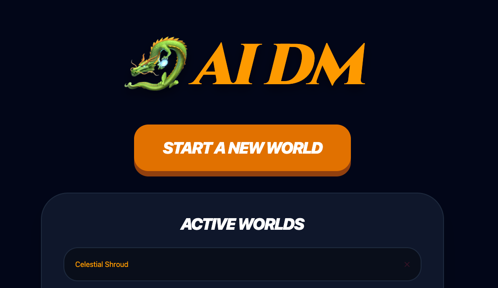

---

## What Is This?

You and your family pick heroes, describe a world, and the AI takes over as DM. Each turn the AI narrates what happens, suggests three actions, and you pick one (or improvise your own). Roll dice. Take damage. Find cursed amulets. Argue about whether kicking a magic tome counts as Might or Mischief.

No prep required. No DM experience required. Just vibes and a d20.

---

## Features

### The Adventure

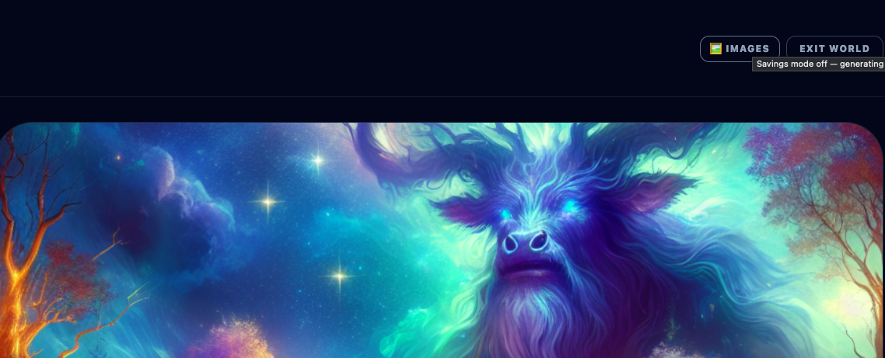

- **AI Dungeon Master** : GPT-4o narrates your story in real-time
- **DALL-E 3 scene images** : every major moment gets illustrated, with a slow Ken Burns pan across the scene
- **Three stats** : Might, Magic, and Mischief (it's a family game)
- **d20 rolls** : classic dice mechanics, displayed with a satisfying SVG die; the exact target needed is shown per action
- **Dynamic difficulty (DRAMA LLAMA)** : the AI tunes the specific roll target per action based on the current situation, within the spirit of the chosen difficulty
- **Inventory with stat bonuses** : find a magic sword, actually get +1 Might
- **Trading** : merchants and vendors can appear in the story and offer trade actions; the party swaps an item they own for something new
- **Per-session image toggle** : the 🖼/🪙 toggle in-session overrides the global images setting; session preference wins
- **Real-time multi-device sync** : everyone at the table can follow along via SSE


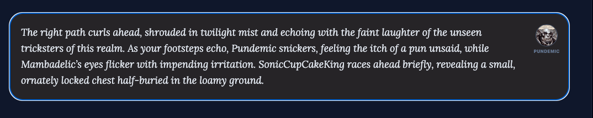

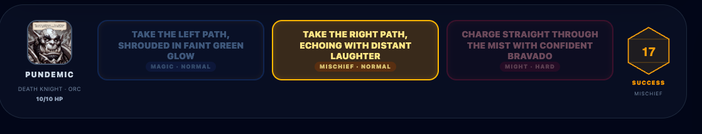

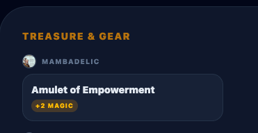

### Your Party

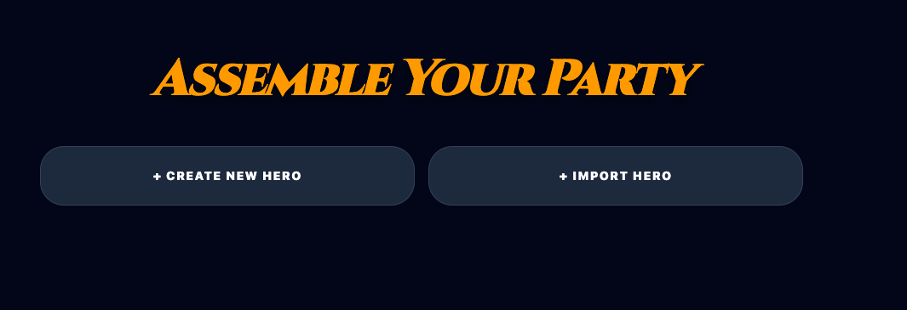

- **Custom hero creation** : name, species, class, quirk, and auto-generated AI portrait
- **Hero library** : import characters from previous adventures
- **HP tracking** : fail a roll, take damage; the stakes are real (ish)
- **Downed state** : reach 0 HP and your hero collapses; teammates must revive you
- **Party wipe rescue** : if everyone goes down, a once-per-session magical intervention saves the party at 1 HP each; a second wipe wakes them in a sanctuary
- **Rolling story summary** : the AI compresses the adventure every 5 turns so context stays sharp across long sessions

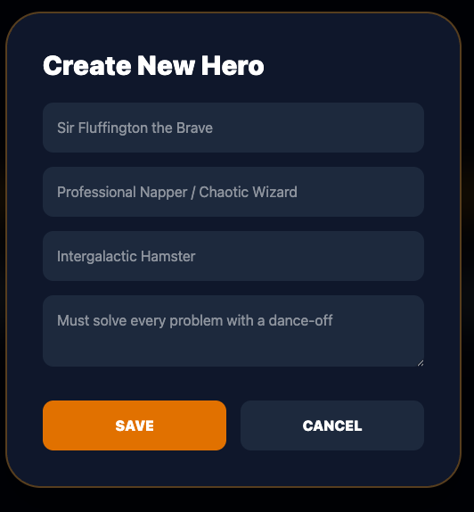

Every hero gets a generated portrait and carries their quirk into the story:

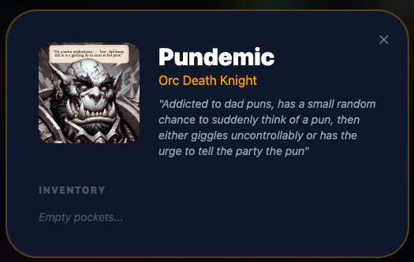 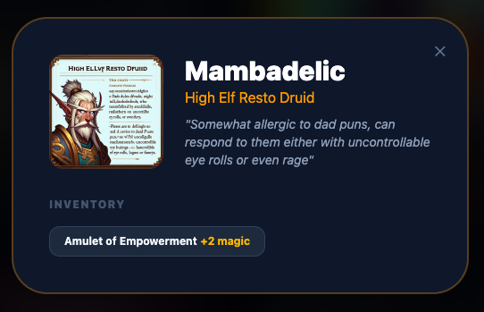

### Between Sessions

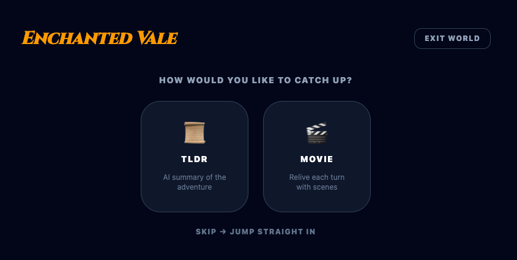

- **TLDR mode** : AI summarises the whole adventure in 3 sentences for latecomers
- **Movie mode** : animated slideshow of every scene, with Ken Burns effect and pause/play controls. Click any image for fullscreen.

### Quality of Life
- **Savings mode** : toggle off image generation per-session (or globally in Settings); session toggle always wins
- **Session persistence** : SQLite, so your adventure survives a server restart
- **World details on home screen** : tap ℹ on any active world to see the party roster, world description, and the last story summary before jumping in
- **Mobile & tablet friendly** : playable on the couch

---

## Tech Stack

| Layer | Tech |
|---|---|
| Frontend | React 19 + Vite + TailwindCSS 4 + TypeScript |
| Backend | Node.js + Express 5 + TypeScript |
| Database | SQLite via `better-sqlite3` (auto-migrated) |
| AI Narration | OpenAI GPT-4o **or** LocalAI (OpenAI-compatible, e.g. Qwen3) |
| AI Images | DALL-E 3 **or** LocalAI (Stable Diffusion via `stablediffusion-ggml`) |
| Real-time | Server-Sent Events |
| Fonts | Cinzel (display) + Lora (narrative) |

---

## Getting Started

### Prerequisites
- Node.js 20+
- One of the AI options below : **no paid account required**

### AI options

**No API key? No problem.** You have three paths:

| Option | Narration | Images | Cost |
|--------|-----------|--------|------|
| OpenAI | GPT-4o | DALL-E 3 | Pay-per-use |
| [Gemini](https://ai.google.dev/gemini-api/docs/openai) (free tier) | Gemini 2.5 Flash Lite | *(paid plan only)* | Free narration with a Google account |
| [OpenRouter](https://openrouter.ai) (free models) | Llama, Mistral, Gemma… | *(not supported)* | Free narration, huge model selection |
| [LocalAI](https://localai.io) | Any GGUF model | Stable Diffusion | Free, runs on your machine |

### 1. Set up environment

Create a `.env` file.

**OpenAI:**
```
OPENAI_API_KEY=sk-proj-...
```

**Gemini (free : any Gmail account):**
Get a key at [aistudio.google.com](https://aistudio.google.com/apikey), then:
```
OPENAI_API_KEY=your-gemini-api-key
OPENAI_BASE_URL=https://generativelanguage.googleapis.com/v1beta/openai/
OPENAI_MODEL=gemini-2.5-flash-lite
AI_NARRATION_PROVIDER=gemini
# Image generation requires a paid Gemini plan : omit for SVG initials fallback
# AI_IMAGE_PROVIDER=openai
# OPENAI_IMAGE_MODEL=gemini-2.5-flash-image
```

**OpenRouter (free models available : no credit card required):**
Get a key at [openrouter.ai/keys](https://openrouter.ai/keys), then:
```
OPENAI_API_KEY=sk-or-...
OPENAI_BASE_URL=https://openrouter.ai/api/v1
OPENAI_MODEL=meta-llama/llama-3.3-8b-instruct:free
# Images not supported by OpenRouter : avatars fall back to SVG initials
```
Browse free models at [openrouter.ai/models?order=top-weekly&supported_parameters=free](https://openrouter.ai/models?order=top-weekly&supported_parameters=free).

**LocalAI (fully self-hosted):**
```
AI_NARRATION_PROVIDER=localai
AI_IMAGE_PROVIDER=localai
LOCALAI_BASE_URL=http://127.0.0.1:8080
LOCALAI_NARRATION_MODEL=qwen3-1.7b
LOCALAI_IMAGE_MODEL=sd-3.5-large-ggml
LOCALAI_IMAGE_STEPS=8
# Optional: separate LocalAI instance just for images (e.g. GPU-only container)
# LOCALAI_IMAGE_BASE_URL=http://127.0.0.1:8081
```

You can also switch between cloud and local per-session using the toggle on the new world screen.

### 2. Install dependencies

```bash
npm run install:all
```

### 3. Run locally

```bash
npm run dev
```

This starts:
- Backend on `http://localhost:3001`
- Frontend on `http://localhost:5173/` (base path `/` for dev)

The Vite dev server proxies `/api/*` → backend automatically.

---

## Project Structure

```
dnd-fam-ftw/
├── backend/
│   └── src/
│       ├── index.ts              # Express API + SSE
│       ├── types.ts              # Shared types
│       ├── services/
│       │   ├── gameEngine.ts     # Dice, damage, state
│       │   ├── aiDmService.ts    # GPT-4o narration
│       │   ├── imageService.ts   # DALL-E 3 + caching
│       │   ├── authService.ts    # Google OAuth + JWT
│       │   └── stateService.ts   # SQLite persistence
│       └── scripts/
│           └── cli.ts            # Unified management CLI (users, namespaces, sessions, metrics, invite-requests)
│
├── frontend/
│   └── src/
│       ├── pages/
│       │   ├── Home.tsx              # World list
│       │   ├── CreateSession.tsx     # New world form
│       │   ├── CharacterAssembly.tsx # Party management + character import
│       │   ├── Session.tsx           # Active gameplay
│       │   ├── SessionRecap.tsx      # TLDR + Movie modes
│       │   ├── NamespacePicker.tsx   # Multi-namespace picker after login
│       │   └── RequestInvite.tsx     # Invite request form for unregistered users
│       └── components/
│           └── game/                 # Narration, ActionControls, Inventory...
│
├── terraform/                    # AWS infrastructure (Lightsail, S3, CloudFront, Route53)
├── scripts/                      # Deploy + install scripts
│   └── deploy/                   # SSH-wrapped management scripts (run-script.sh)
├── .github/workflows/            # CI/CD (deploy.yml, lint.yml, test.yml, renew-cert.yml)
├── docs/                         # Screenshots
└── .env                          # OPENAI_API_KEY goes here
```

---

## Deployment

### AWS (production)

The app deploys to AWS via GitHub Actions (`.github/workflows/deploy.yml`). Infrastructure is provisioned with Terraform (`terraform/`):

| Resource | Purpose |
|---|---|
| AWS Lightsail | Ubuntu VPS running the Node backend |
| S3 | Frontend static files + generated images |
| CloudFront | CDN for frontend and images |
| Route53 | DNS for API and frontend domains |
| SSM Parameter Store | Secrets (Google OAuth, JWT, etc.) |

**First-time setup:**
1. Copy `terraform/terraform.tfvars.example` to `terraform/terraform.tfvars` and fill in your values
2. Run `terraform apply` in `terraform/`
3. Fill in SSM parameters: `./scripts/fill-ssm-params.sh`
4. Provision TLS cert: `./scripts/provision-cert.sh`
5. Push a `v*` tag to trigger a full deploy

**CI/CD secrets** required in the GitHub `production` environment: `AWS_ACCESS_KEY_ID`, `AWS_SECRET_ACCESS_KEY`, `LIGHTSAIL_INSTANCE_NAME`, `LIGHTSAIL_HOST`, `SSH_PRIVATE_KEY`, `API_DOMAIN`, `FRONTEND_DOMAIN`, `FRONTEND_BUCKET_NAME`, `IMAGE_BUCKET_NAME`, `CF_DIST_ID`.

**Change detection:** The deploy workflow only rebuilds what changed (backend or frontend) since the last deploy. Tag pushes always deploy everything.

### Local laptop (legacy)

The app can also run at a subpath (`/dnd-fam-ftw/`) behind Nginx on a local Linux server:

```bash
# First time setup on the server
./scripts/install-ubuntu.sh

# Push local changes to server and restart
./scripts/re-deploy.sh
```

The backend runs as a systemd service. `re-deploy.sh` sets `VITE_BASE_PATH=/dnd-fam-ftw/` automatically for the frontend build.

### Production management scripts

Run via SSH wrapper using the same `<resource> <sub-command>` interface as the local CLI:

```bash
./scripts/deploy/run-script.sh users list
./scripts/deploy/run-script.sh namespaces list
./scripts/deploy/run-script.sh metrics
./scripts/deploy/run-script.sh invite-requests list
```

See **[MANAGE.md](MANAGE.md)** for the full command reference.

---

## AI Usage

There are six distinct AI calls in the app, each with a different purpose and cost profile:

| Call | Where | Cloud model | Local alternative | When |
|---|---|---|---|---|
| **Turn narration** | `aiDmService.ts` | gpt-4o | LocalAI (Qwen3 etc.) | Every action : the core DM loop |
| **Scene image** | `imageService.ts` | dall-e-3 | LocalAI (SD 3.5 Large) | Every turn, async via SSE, cached by prompt hash |
| **Avatar generation** | `imageService.ts` | dall-e-3 | LocalAI (SD 3.5 Large) | Once per character creation, cached permanently |
| **TLDR summary** | `index.ts` (route) | gpt-4o-mini | - | On demand in recap screen |
| **Session naming** | `stateService.ts` | gpt-4o-mini | LocalAI | Once at world creation |
| **Character history** | `index.ts` (route) | gpt-4o-mini | - | When importing a character from a previous session |

Use `npm run cli -- metrics` (or `./scripts/deploy/run-script.sh metrics` on production) to see per-namespace counts for sessions, turns, images, and avatars generated.

Turn narration is the only call that blocks the player response. Scene images are generated asynchronously after the turn : the story text appears immediately, and the image arrives via SSE a few seconds later.

---

## Real-time Events (SSE)

All connected clients receive the same events via Server-Sent Events:

| Event | When | What happens on the client |
|-------|------|----------------------------|
| `turn_complete` | After every turn | Narration + new choices appear; session state refreshes |
| `image_ready` | After async image generation | Scene image fades in |
| `party_update` | After a `use_item` / `give_item` action | Party HP and inventory update without a full turn refresh |
| `intervention` | All party members downed, first time | Amber 🐉 rescue banner shown for 8 s |
| `sanctuary_recovery` | All party members downed, second time | Grey 🏕️ sanctuary banner shown for 10 s |

---

## How a Turn Works

```
Player picks action (each choice carries a suggested difficulty target from the AI)
       ↓
Backend resolves target: per-action difficultyValue if set, else base threshold (8/12/16)
       ↓
Backend rolls d20 + effective stat vs. resolved target
       ↓
Result sent to AI with full session context (outcome already resolved)
       ↓
AI narrates outcome + suggests 3 new choices (each with a tuned difficultyValue)
     + optionally grants an item (suggestedInventoryAdd)
     + optionally removes an item for a trade (suggestedInventoryRemove)
       ↓
SSE broadcasts turn_complete → all connected clients update immediately
       ↓
Image generation runs in background if session savingsMode is off (DALL-E 3 or LocalAI SD)
       ↓
SSE broadcasts image_ready → scene image appears on all clients
```

The AI **cannot mutate game state directly** : it only returns structured JSON. The backend owns all mechanics.

---

## Auth and Multi-User Setup

Auth is optional. Without Google OAuth credentials everything runs under a single `local` namespace.

When auth is enabled, each user gets their own namespace (isolated sessions). Users can be granted access to additional namespaces by an admin.

```bash
./scripts/deploy/run-script.sh users list
./scripts/deploy/run-script.sh users add someone@gmail.com "Their Name"
./scripts/deploy/run-script.sh namespaces list
./scripts/deploy/run-script.sh namespaces add-user <namespaceId> someone@gmail.com
./scripts/deploy/run-script.sh namespaces set-limits <namespaceId> --max-sessions 5 --max-turns 100
./scripts/deploy/run-script.sh invite-requests list
```

Users with multiple namespace access will see a picker screen after login. For the full command reference see **[MANAGE.md](MANAGE.md)**.

For the complete ruleset : dice math, downed state, party wipes, item mechanics, story compression, SSE events : see **[GAME_ENGINE_RULES.md](GAME_ENGINE_RULES.md)**.

---

## Starting a New World

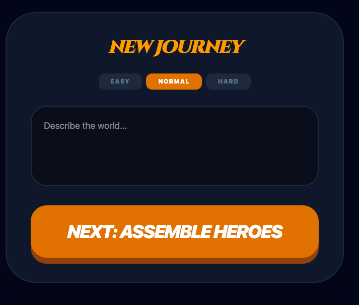

Pick a difficulty, describe your world (or leave it blank for a surprise), and hit **Next: Assemble Heroes**.

---

## The Three Stats

| Stat | Good For |
|---|---|
| **Might** | Hitting things, breaking things, lifting things, being a goblin wrecking ball |
| **Magic** | Spells, healing, arcane shenanigans, summoning things that immediately cause problems |
| **Mischief** | Stealing, lying, sneaking, persuading the dragon that you're actually the tax collector |

---

## Tips

- The AI takes the `quirk` field seriously. A character who *"has strong opinions about cheese"* will absolutely have those opinions come up at the worst possible moment.
- Savings mode is your friend during testing. DALL-E isn't cheap.
- The TLDR recap is great for the family member who missed last week's session and claims they "totally remember what happened."

---

*Built with love, bad puns, and an irresponsible number of API calls.*

---

[Beerware License](LICENSE) : if you like it, buy me a beer someday.
