# Screenshots

All images except the MCP one are generated by `npm run generate-readme-screenshots` (`frontend/tests/readme-screenshots.spec.ts`), which boots a seeded backend and the frontend with mocked AI, so no paid calls are made. Keep the file names stable: the README and other docs link to them.

## Home

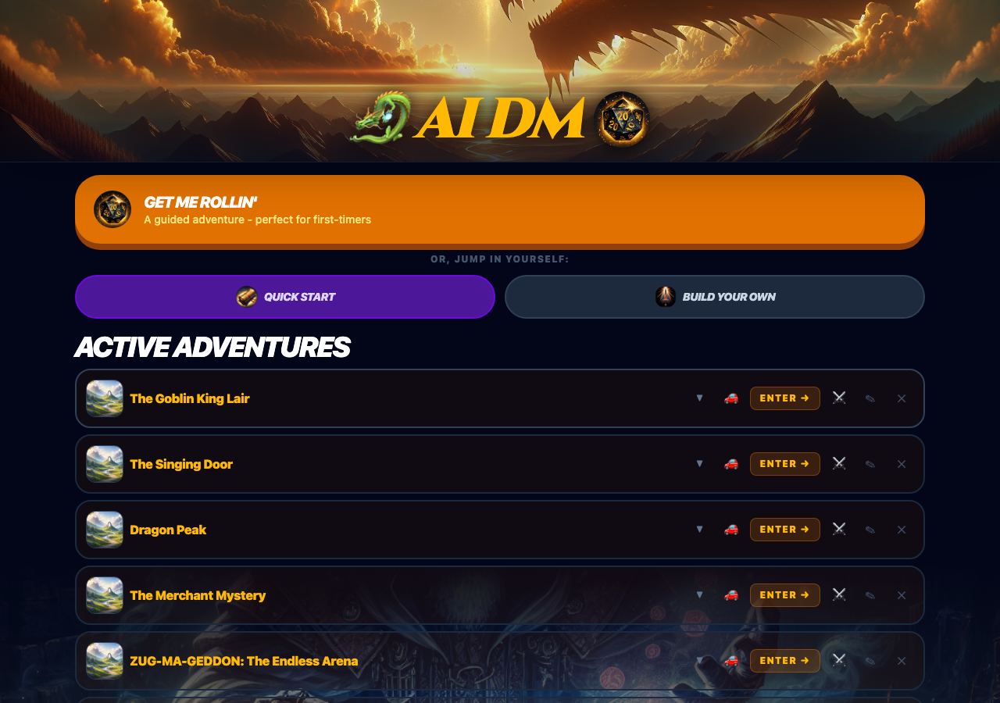

## Starting an adventure

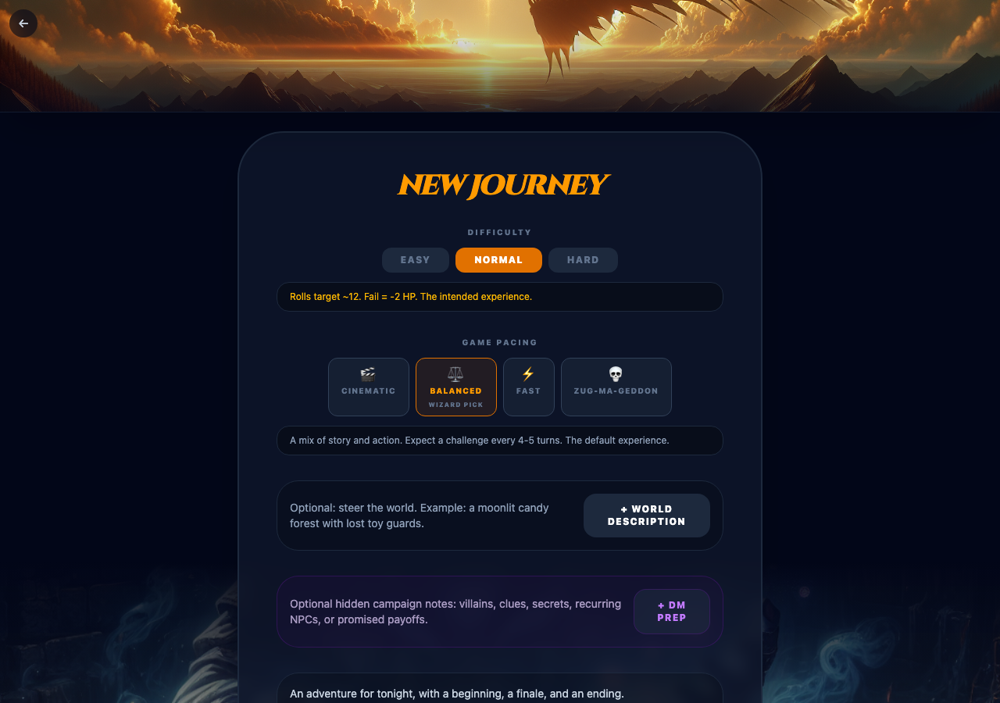

Pick a difficulty, a pacing (Cinematic, Balanced, Fast, or ZUG-MA-GEDDON for pure chaos), describe the setting or leave it blank for a surprise, and optionally add [DM Prep](../DM_PREP.md) notes.

## Your party

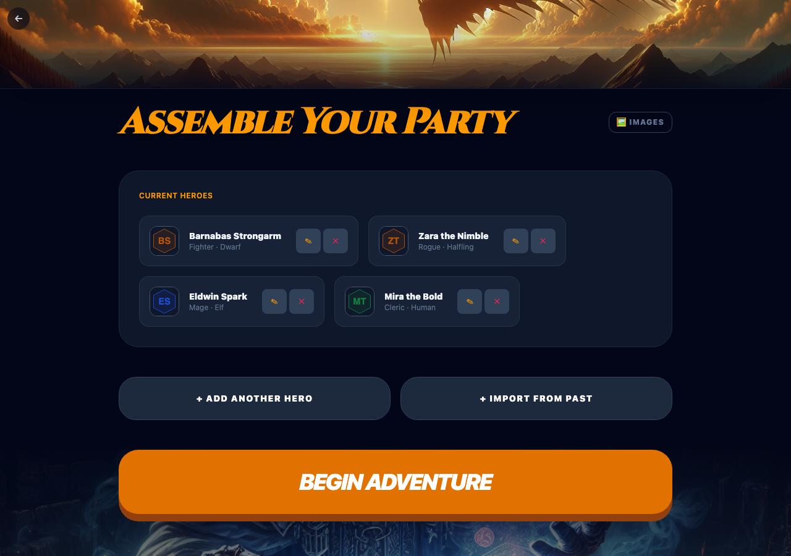

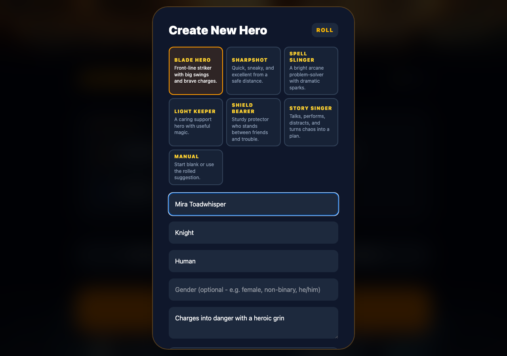

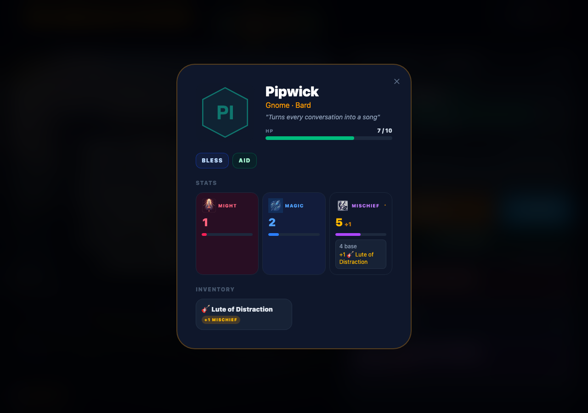

## Playing

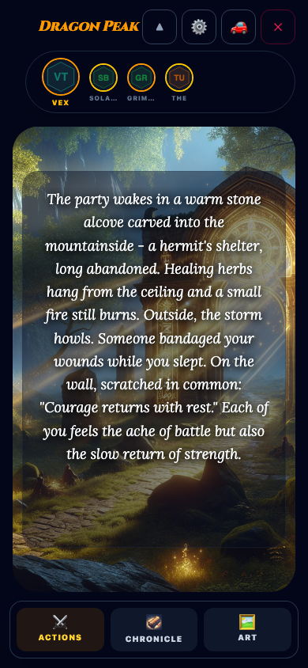

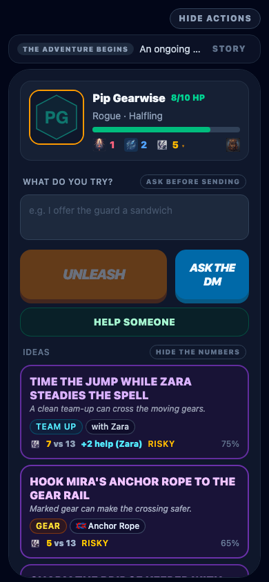

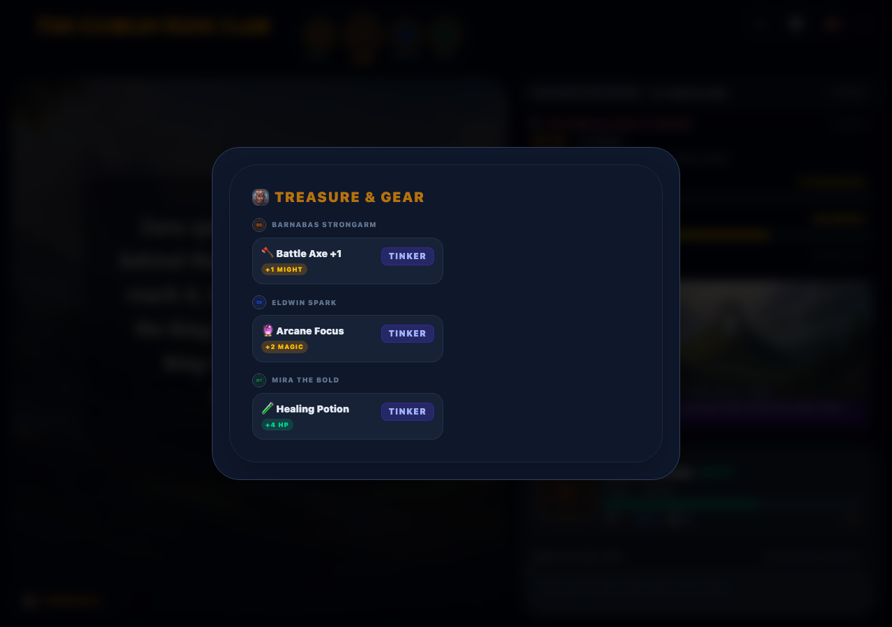

## Between sessions

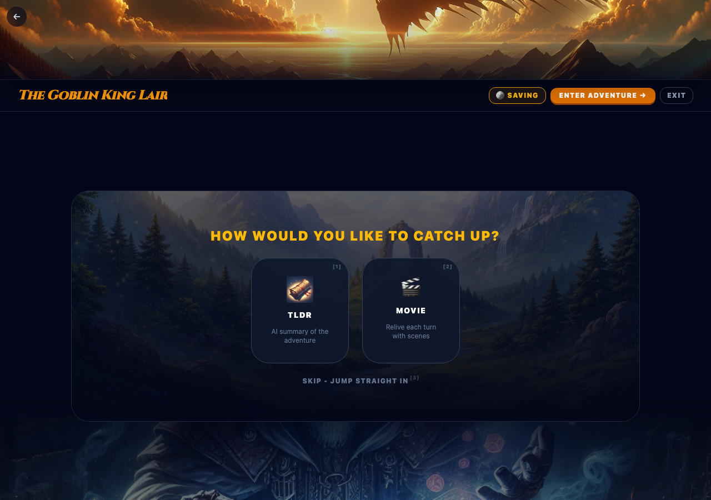

## Other ways to play

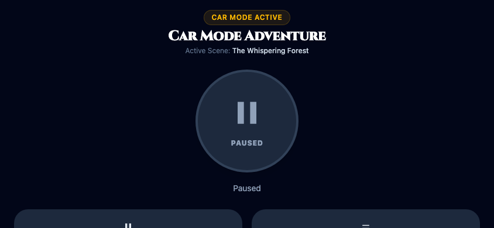

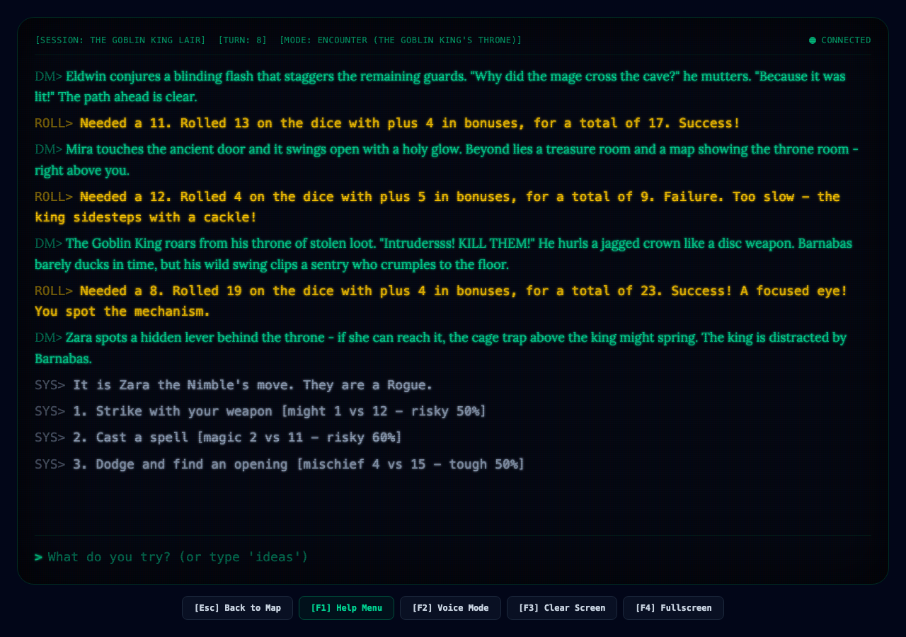

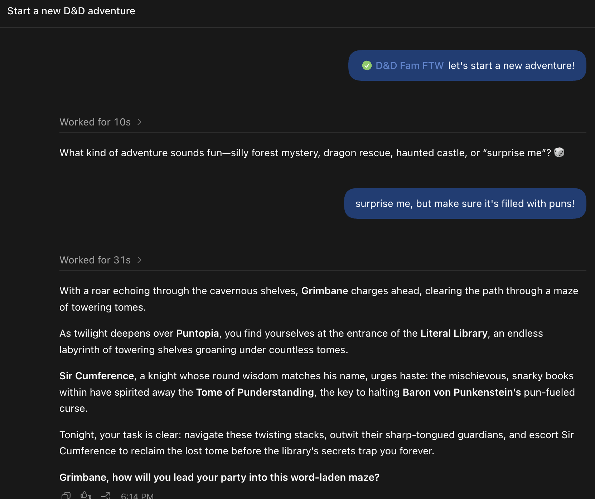
